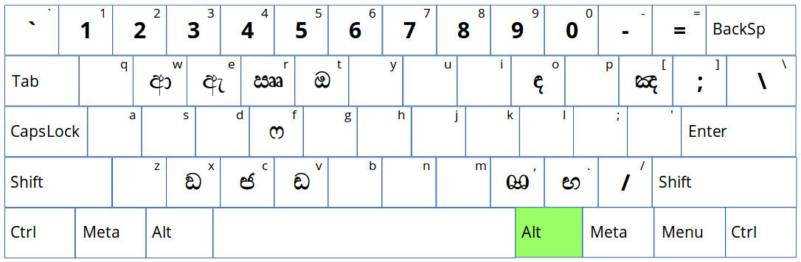

# Sinhala Wijesekara Layout Key Board
Sinhala - Wijesekara layout keyboard for Ubuntu based distributions.

Within this repository you can find a modified key mapper (symbols) file of xkb lk layout.

## Prerequisites

This is just a implementation of the symbols file. Therefore in order to use this you should have Sinhala installed in your distribution beforehand.

## How to Replace the Mapper

01. **IMPORTANT** : First take a backup of your original lk layout file. (/usr/share/X11/xkb/symbols/lk)

	```
	cp /usr/share/X11/xkb/symbols/lk /your/backup/location/lk.backup
	```
02. Replace the lk file with the layout file (lk) you find in this repository. 

03. You would have to run following command to update the changes.

	```
	sudo dpkg-reconfigure xkb-data
	```


## How to Type - Character map

### Without any Modifiers

The image bellow explains the behavior of your keyboard when you're not using any modifier key.


### With "Shift" key

In order to switch to the following layout you should press and hold the "Shift" key before pressing the characters.


### With right "Alt" key

To reach the third level of characters you should press and hold the "Alt" key located to the right of your space bar.



### With both "Shift" and right "Alt" keys

This combination of modifiers provides you the access to the fourth layer of the characters.


## Special Characters

In order to get these kind of characters to work, a special character called **Zero Width Joiner - ZWJ** is used. After activating Sinhala layout you can type ZWJ by pressing *right Alt + /*
```
ZWJ = right Alt + /
```

As you can see, in the above layouts, you can't find two of commonly used characters (or පිල්ලම් to be persice). namely Yansaya (example: මුඛ්‍ය) and Rakaransaya (example: ක්‍රමය). Here is how you could get those two characters into your content.

### Yansaya
	English layout : a -> ZWJ -> h
	Sinhala layout : ් -> ZWJ -> ය

Example

	මුඛ්‍ය = මු -> ඛ -> ් -> ZWJ -> ය


### Rakaransaya
	English layout : a -> ZWJ -> r
	Sinhala layout : ් -> ZWJ -> ර

Example

	ක්‍රමය = ක -> ් -> ZWJ -> ර -> ම -> ය

### Repaya

Although this is not commonly used, you can use this by following this procedure.

	English layout : r -> a -> ZWJ
	Sinhala layout : ර -> ් -> ZWJ

Example

	කර්‍මය = ක -> ර -> ් -> ZWJ -> ම -> ය

## Tightened Characters (බැඳි අකුරු)

If you prefer using these sort of characters ZWJ can help you with that as well.

Syntax

	first character -> ZWJ -> second character

Examples

	න්‍ද = න -> ් -> ZWJ -> ද
	ක්‍ෂ = ක -> ් -> ZWJ -> ෂ

## Known Issues

	එ -> ් does not transform into ඒ

This is a known issue and in order to over come this, the character 'ඒ' is added in to the *Shift + t* position. However as a side effect, I had to push the character 'ඔ' from *Shift + t* position to *right Alt + t* position. You can find the character 'ඕ' at *Shift + right Alt + t* position.
