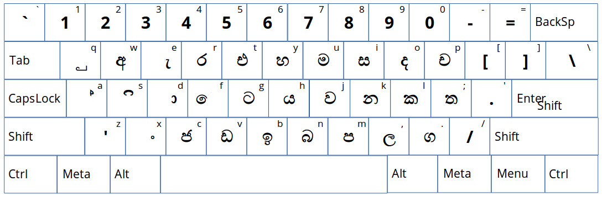
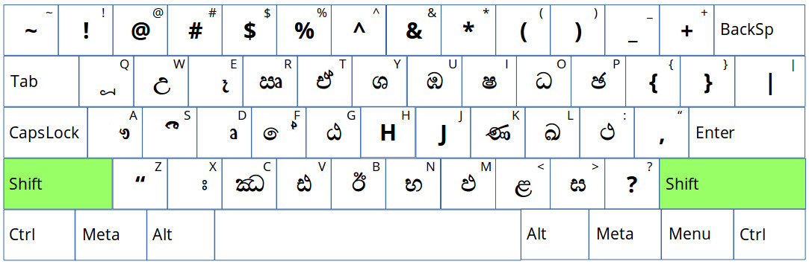
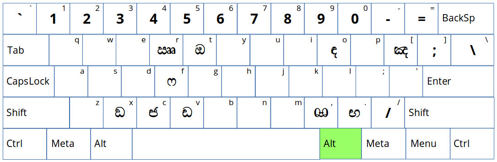
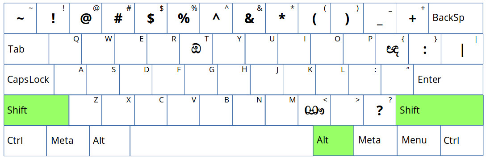

# Sinhala Wijesekera Layout Key Board
Sinhala - Wijesekera layout keyboard for Ubuntu Based distributions.

Within this repository you can find a modified key mapper (symbols) file of xkb lk layout.

# Prerequisits

This is just a implementation of the symbols file. Therefore in order to use this you should have Sinhala installed in your destribution beforehand.

# How to Replace the Mapper

01. **IMPORTANT** : First take a backup of your original lk layout file. (/usr/share/X11/xkb/symbols/lk)
```
cp /usr/share/X11/xkb/symbols/lk /your/backup/location/lk.backup
```
02. Replace the lk file with the layout file (lk) you find in this repository. 


# How to Type

Character map

## Withoug any Modifiers

The image bellow explains the behaviour of your keyboard when you're not using any modifier key.



## With "Shift" key

In order to switch to the following layout you should press and hold the "Shift" key before pressing the characters.



## With right "Alt" key

To reach the third level of characters you shoulc press and hold the "Alt" key located to the right of your space bar.



## With both "Shift" and right "Alt" keys

This combination of modifiers provides you the access to the fourth layer of the characters.



